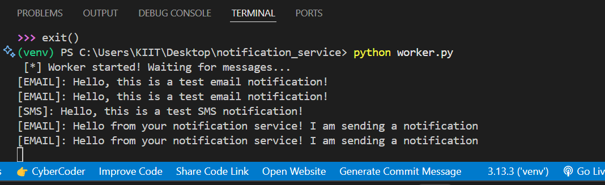

# 🚀 Notification Service

Welcome to the Notification Service – a modern, extensible solution for user notifications built using **FastAPI**, **MySQL**, and **RabbitMQ**.  
This project is designed to demonstrate robust backend architecture, decoupled processing, and scalable design practices.

---

## 🌟 Features

- **Unified Notification API** – Easily send notifications (Email, SMS, or In-App) to any user.
- **Reliable Delivery** – Asynchronous processing via RabbitMQ keeps the API fast and ensures delivery, even under high load.
- **Retry on Failure** – Automated retries for failed notification attempts.
- **Persistent Audit Trail** – Every notification is stored in MySQL and can be fetched for any user at any time.
- **Interactive API Documentation** – Instantly test every endpoint using the built-in Swagger UI.

---

## 🛠️ Tech Stack

- **Python 3.9+**
- **FastAPI** (modern, async-ready web API framework)
- **MySQL** (robust SQL database)
- **RabbitMQ** (enterprise-grade message queue)
- **SQLAlchemy** (elegant ORM for Python)
- **Docker** (for local RabbitMQ deployment)

---

## ⚡ Quickstart Guide

### 1. Clone the Project

```bash
git clone <YOUR_REPO_LINK_HERE>
cd notification_service
```

### 2. Python Environment Setup
Create and activate a virtual environment

### Windows:
```bash

python -m venv venv
venv\Scripts\activate
```
Mac/Linux:
```bash

python3 -m venv venv
source venv/bin/activate
```
Install required libraries:
```bash

pip install -r requirements.txt
```

## 3. Environment Configuration
Create a .env file in the project root and add:


DB_HOST=localhost
DB_PORT=3306
DB_USER=notification_user
DB_PASS=notification_password
DB_NAME=notification_db
RABBITMQ_HOST=localhost

## 4. MySQL Database Initialization
In MySQL Workbench or CLI, run:

```SQL

CREATE DATABASE notification_db CHARACTER SET utf8mb4 COLLATE utf8mb4_unicode_ci;
CREATE USER 'notification_user'@'%' IDENTIFIED BY 'notification_password';
GRANT ALL PRIVILEGES ON notification_db.* TO 'notification_user'@'%';
FLUSH PRIVILEGES;
```
5. Start RabbitMQ (via Docker)
Make sure Docker Desktop is running, then execute:
```bash

docker run -d --hostname rabbit --name rabbitmq -p 5672:5672 -p 15672:15672 rabbitmq:3-management
RabbitMQ Management Console: http://localhost:15672 (username/password: guest/guest)
```
### 6. Set Up the Database Table
```bash

python
>>> from app.database import create_db
>>> create_db()
>>> exit()
```

### 7. Run the Worker and API
Terminal 1 (Worker):
```bash
python worker.py
```
Terminal 2 (API):
```
uvicorn app.main:app --reload
```
Visit http://127.0.0.1:8000/docs for interactive API documentation and testing.

📚 Example Usage
➕ Sending a Notification
POST /notifications

```json

{
  "user_id": 1,
  "notification_type": "sms",     // "email", "sms", or "inapp"
  "content": "Your OTP is 123456."
}
```
🔍 Fetching User Notifications
GET /users/1/notifications
Returns a JSON array of all notifications for user 1, including statuses.

## 🔁 How the Service Works
```
New notifications are written to MySQL and pushed to RabbitMQ.
The background worker consumes tasks, simulates delivery (prints to console), and updates the notification status.
If delivery fails, notifications are retried with exponential backoff (up to 3 attempts).
```
#📝 Assumptions
```
User records and authentication are managed outside this service.
Email/SMS sending is simulated in code but can be easily swapped for integration with real services (see app/notifier.py).
API endpoints are unauthenticated for demonstration purposes.
```
#💡 Possible Extensions
```
Integrate with real SMS/email APIs (e.g., Twilio, SendGrid).
Add JWT authentication or user session tracking.
Deploy the full app stack using Docker Compose for portability.
Set up automated tests for all endpoints.
```
#👤 Author
ANUSHKA VERMA
```link
[https://www.linkedin.com/in/anushka-verma-352b4b278/]
```

Built for reliability, extensibility, and real-world readiness. Enjoy exploring and using this Notification Service! 🎉
